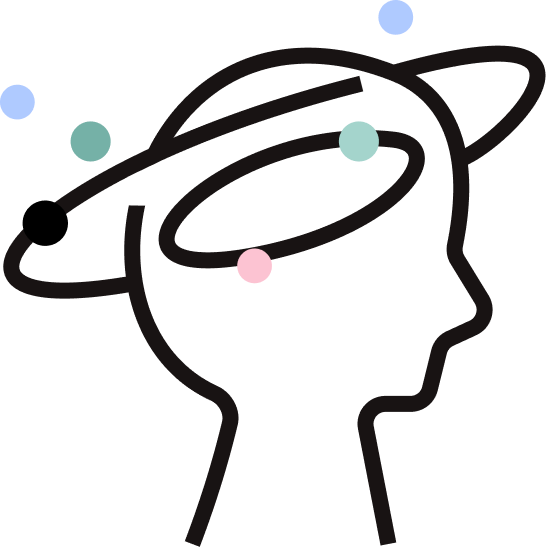

<h1 align="center">
   
  
   
  DopaMind - Mental Health Support Application
   
</h1>

  <a href="#key-features">Key Features</a> •
  <a href="#tech-stack">Tech Stack</a> •

## About

DopaMind is an Android application designed to provide comprehensive mental health support through various features including mood tracking, counseling services, and emergency assistance. The app aims to make mental health support accessible, convenient, and user-friendly.

## Key Features

### 1. Diary Journal & Mood Tracker
- Write and track daily mood entries
- AI-powered mood analysis using NLP
- Visual mood statistics and history
- Personalized mood insights

### 2. Professional Support
- Book appointments with licensed psychologists
- View detailed professional profiles
- Secure payment integration
- Schedule management and reminders
- Direct communication with healthcare providers

### 3. Chat Support
- AI-powered chatbot (Dopi) for immediate support
- Natural conversation interface
- 24/7 availability
- Personalized responses based on user history
- Mental health resources and coping strategies

### 4. Emergency Services (SOS)
- Quick access to nearby hospitals
- Real-time location tracking
- Emergency contact integration
- Interactive map with hospital information
- Turn-by-turn navigation to nearest facility

### 5. Educational Content
- Mental health articles
- Lifestyle content
- Regular updates from trusted sources
- Personalized content recommendations
- Bookmark and share functionality

### 6. Additional Features
- Sleep tracker
- Relaxation exercises
- Progress monitoring
- Profile customization
- Data privacy controls

## Tech Stack

- **Language:** Kotlin
- **Architecture:** MVVM (Model-View-ViewModel)
- **Dependencies:**
  - AndroidX Core KTX
  - AndroidX AppCompat
  - Material Design Components
  - Navigation Components
  - Retrofit & OkHttp
  - Glide
  - DataStore Preferences
  - Google Play Services (Location & Maps)
  - ViewBinding Property Delegate

## Requirements

- Android Studio Arctic Fox or newer
- Min SDK 24
- Target SDK 34
- Kotlin version 1.9.0
- Google Maps API Key
- Internet Connection
